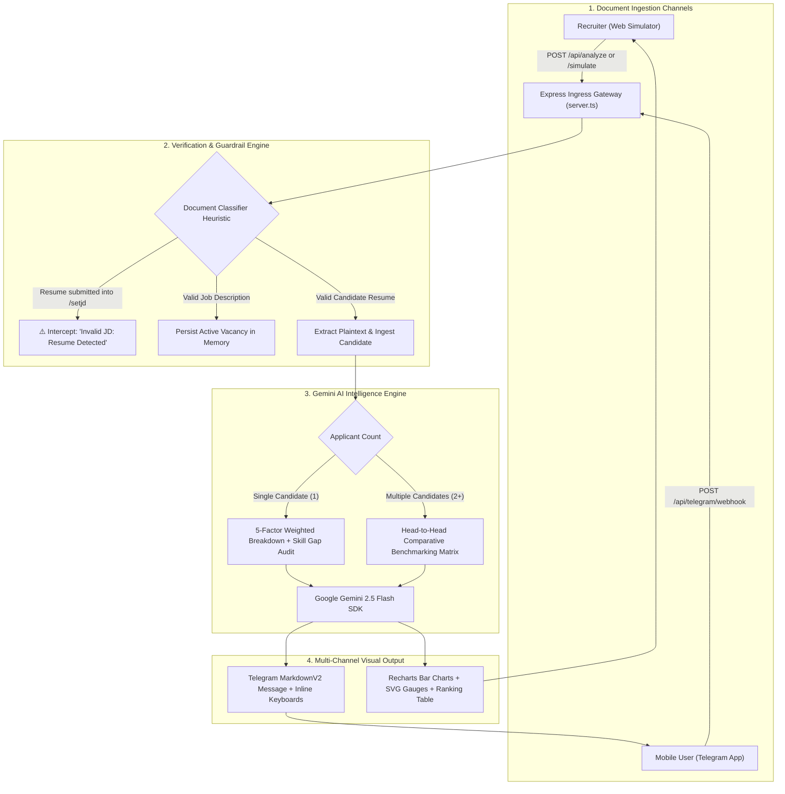
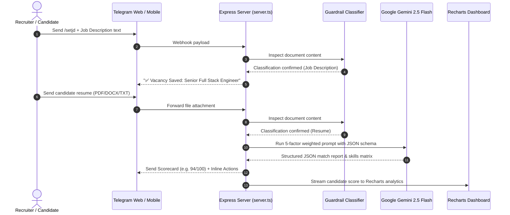

# 🤖 API_Hashira — Enterprise ATS Resume Screener & Autonomous Telegram AI Bot

```
  █████╗ ██████╗ ██╗    ██╗  ██╗ █████╗ ███████╗██╗  ██╗██╗██████╗  █████╗ 
 ██╔══██╗██╔══██╗██║    ██║  ██║██╔══██╗██╔════╝██║  ██║██║██╔══██╗██╔══██╗
 ███████║██████╔╝██║    ███████║███████║███████╗███████║██║██████╔╝███████║
 ██╔══██║██╔═══╝ ██║    ██╔══██║██╔══██║╚════██║██╔══██║██║██╔══██╗██╔══██║
 ██║  ██║██║     ██║    ██║  ██║██║  ██║███████║██║  ██║██║██║  ██║██║  ██║
 ╚═╝  ╚═╝╚═╝     ╚═╝    ╚═╝  ╚═╝╚═╝  ╚═╝╚══════╝╚═╝  ╚═╝╚═╝╚═╝  ╚═╝╚═╝  ╚═╝
```

[](LICENSE)
[](https://nodejs.org/)
[](https://aistudio.google.com/)
[](https://vitejs.dev/)
[](Dockerfile)
[](.github/workflows/ci.yml)

**API_Hashira** is a complete, full-stack **Applicant Tracking System (ATS)** and **AI-powered Recruiter Agent**. It parses and screens candidate resumes against target **Job Descriptions (JDs)**, calculates an objective **0–100 compatibility score**, pinpoints critical technical and domain skill gaps, generates actionable ATS booster tips, and compares multiple candidates head-to-head.

---

## 📑 Table of Contents

- [✨ Key Features](#-key-features)
- [🏛️ System Architecture & Workflow](#️-system-architecture--workflow)
- [📊 The 5-Factor Weighted ATS Scoring Algorithm](#-the-5-factor-weighted-ats-scoring-algorithm)
- [🛡️ Intelligent Guardrails: Document Classifier](#️-intelligent-guardrails-document-classifier)
- [🤖 Telegram Bot Commands & Interactive Keyboards](#-telegram-bot-commands--interactive-keyboards)
- [📁 Comprehensive Repository File Structure](#-comprehensive-repository-file-structure)
- [🚀 Creating & Pushing to a Brand New Git Repository](#-creating--pushing-to-a-brand-new-git-repository)
- [💻 Local Setup & Development Guide](#-local-setup--development-guide)
- [🐳 Docker & Container Deployment](#-docker--container-deployment)
- [📡 API Endpoints & Telegram Webhooks](#-api-endpoints--telegram-webhooks)
- [⚙️ Configuration & Environment Variables](#️-configuration--environment-variables)
- [🤝 Contributing & License](#-contributing--license)

---

## ✨ Key Features

- **Autonomous Telegram Bot (`@ATS_4405_bot`)**: Real-time document parsing, markdown score summaries, and inline interactive keyboards directly inside Telegram.
- **Modern Obsidian & Cyber Cyan Interface**: High-tech recruiter workspace styled in deep obsidian navy with luminous neon cyan and emerald accents.
- **5-Factor Weighted Algorithm**: Mathematical scoring balancing technical skills (40%), work experience (25%), role alignment (20%), education (10%), and formatting (5%).
- **Head-to-Head Comparative Benchmarking**: Multi-resume visual comparison highlighting shared skills and decisive differentiators.
- **Inverted-Input Guardrails**: Automatic heuristic classifier preventing users from accidentally submitting candidate resumes into the target job vacancy slot.
- **Tailored Interview Question Generator**: AI-synthesized behavioral and technical interview questions probing each candidate's exact weak points.
- **Dual Operating Modes**: Use the embedded in-browser Telegram Simulator or toggle into the Full-Screen Recruitment Workspace.

---

## 🏛️ System Architecture & Workflow



### End-to-End Sequence Flow



---

## 📊 The 5-Factor Weighted ATS Scoring Algorithm

The evaluation system departs from naive keyword density calculations, computing an objective composite score across five distinct dimensions:

$$\text{Final ATS Score} = (S_{\text{tech}} \times 0.40) + (E_{\text{rel}} \times 0.25) + (A_{\text{jd}} \times 0.20) + (C_{\text{edu}} \times 0.10) + (F_{\text{ats}} \times 0.05)$$

```
DIMENSION                                WEIGHT   EVALUATION CRITERIA
━━━━━━━━━━━━━━━━━━━━━━━━━━━━━━━━━━━━━━━━━━━━━━━━━━━━━━━━━━━━━━━━━━━━━━━━━━━━━━━━━━━━━━━━━━━━
1. Core Technical Skills & Stack         [40%]    Exact & semantic match of frameworks, languages & cloud
2. Commercial Work Experience            [25%]    Years of production tenure, team scope & system volume
3. Role & Seniority Alignment            [20%]    Direct alignment with job responsibilities & leadership level
4. Education & Certifications            [10%]    Accredited degrees, AWS/GCP/Kubernetes certifications
5. ATS Readability & Keywords            [ 5%]    Clean hierarchy, parsable section titles, action verbs
━━━━━━━━━━━━━━━━━━━━━━━━━━━━━━━━━━━━━━━━━━━━━━━━━━━━━━━━━━━━━━━━━━━━━━━━━━━━━━━━━━━━━━━━━━━━
```

### Candidate Hiring Tiers

| Tier | Score Range | Classification | Status & Next Actions |
| :--- | :---: | :---: | :--- |
| **Tier 1: Exceptional** | **85 – 100%** | 🟢 **Strong Fit** | Fast-track directly to technical interview rounds |
| **Tier 2: Solid** | **70 – 84%** | 🟡 **Moderate Fit** | Phone screen; probe missing secondary competencies |
| **Tier 3: Marginal** | **50 – 69%** | 🟠 **Low Fit** | Retain in pipeline for junior or adjacent openings |
| **Tier 4: Mismatch** | **< 50%** | 🔴 **Reject** | Candidate fails critical prerequisite requirements |

---

## 🛡️ Intelligent Guardrails: Document Classifier

Recruiters frequently paste a candidate's resume when prompted to set the target Job Description (`/setjd`). **API_Hashira** prevents database pollution through automated structural pattern recognition:

```
                  ┌──────────────────────────────┐
                  │ Document Ingestion Pipeline  │
                  └──────────────┬───────────────┘
                                 │
                 Analyze Structural Vocabulary
                                 │
           ┌─────────────────────┴─────────────────────┐
           ▼                                           ▼
   Resume Signatures                           JD Signatures
 • "Curriculum Vitae" / "CV"                 • "Job Summary" / "About the Role"
 • "Education" / "GPA" / "Degree"            • "Key Responsibilities"
 • "Work History" / "Employment"             • "Required Qualifications"
 • "Personal Contact" / "LinkedIn"           • "Benefits & Compensation"
           │                                           │
           ▼                                           ▼
   Resume Score: High                          JD Score: High
           │                                           │
 ┌─────────┴─────────┐                       ┌─────────┴─────────┐
 │ Input into /setjd?│                       │ Input into /setjd?│
 └───┬───────────┬───┘                       └───┬───────────┬───┘
 YES │           │ NO                        YES │           │ NO
     ▼           ▼                               ▼           ▼
 ⚠️ Intercept   Process Candidate             ✅ Update   ⚠️ Prompt
 Warning Return    Evaluation                  Vacancy     Correction
```

---

## 🤖 Telegram Bot Commands & Interactive Keyboards

| Command | Shortcut | Functionality |
| :--- | :---: | :--- |
| `/start` | 🏠 | Initializes conversation, displays bot capabilities and active vacancy status |
| `/scan` | ⚡ | Runs full 5-factor ATS audit on the most recently uploaded candidate resume |
| `/compare` | 👥 | Executes head-to-head benchmarking between two or more uploaded candidate resumes |
| `/setjd` | 📄 | Sets or replaces the active target vacancy job description |
| `/viewjd` | 🔍 | Displays current vacancy title, company overview, and required skill checklist |
| `/tips` | 💡 | Delivers prioritized ATS formatting and keyword optimization suggestions |
| `/questions`| ❓ | Synthesizes custom technical & behavioral interview questions targeting candidate gaps |
| `/webhook` | ⚙️ | Displays current Telegram webhook status and configuration guidance |

---

## 📁 Comprehensive Repository File Structure

```
API_Hashira/
├── .github/
│   └── workflows/
│       └── ci.yml                 # Automated CI workflow (Build, Type-Check & Lint)
├── docs/
│   ├── ARCHITECTURE.md            # Deep-dive system architecture and data models
│   └── TELEGRAM_GUIDE.md          # Complete step-by-step @BotFather setup manual
├── scripts/
│   └── simulate-ats.ts            # CLI execution script for running ATS evaluations
├── src/
│   ├── components/
│   │   ├── AtsFullScreenAnalyzer.tsx  # Full recruitment dashboard workspace
│   │   ├── AtsTipsSection.tsx         # ATS optimization advice & score booster tips
│   │   ├── CandidateCard.tsx          # Individual applicant card with visual score gauge
│   │   ├── ConnectWhatsAppModal.tsx   # Channel connection modal dialog
│   │   ├── MarkdownReportView.tsx     # Formatted markdown report exporter
│   │   ├── RankingTable.tsx           # Sortable candidate leaderboard with tier filters
│   │   ├── TelegramBotScreen.tsx      # Interactive Telegram Web client simulator
│   │   ├── TelegramConnectModal.tsx   # Telegram Bot token verification modal
│   │   └── WhatsAppChartWidget.tsx    # Compact chart widget component
│   ├── data/
│   │   └── sampleData.ts          # Pre-loaded vacancy (Senior Full Stack) & 2 resumes
│   ├── utils/
│   │   └── fileParser.ts          # Text, PDF, and DOCX document extraction utilities
│   ├── App.tsx                    # Root React coordinator managing global state
│   ├── index.css                  # Global Tailwind CSS directives
│   ├── main.tsx                   # React 19 application entry point
│   └── types.ts                   # TypeScript interfaces, schemas, and candidate models
├── .dockerignore                  # Docker build exclusion rules
├── .env.example                   # Environment variable blueprint
├── .gitignore                     # Git tracking exclusions
├── CONTRIBUTING.md                # Open-source contribution standards & workflow
├── Dockerfile                     # Multi-stage production container definition
├── docker-compose.yml             # Local multi-service container configuration
├── LICENSE                        # MIT Open-Source License
├── metadata.json                  # Application metadata & permission declarations
├── package.json                   # Project dependencies and script declarations
├── README.md                      # Comprehensive project documentation
├── server.ts                      # Express.js backend, Gemini AI SDK & Telegram webhook
├── tsconfig.json                  # TypeScript compiler options
└── vite.config.ts                 # Vite bundler & Tailwind plugin setup
```

---

## 🚀 Creating & Pushing to a Brand New Git Repository

If you wish to host this project in a **brand new GitHub repository**, follow these exact terminal commands:

### Step 1: Create a New Repository on GitHub
1. Navigate to [github.com/new](https://github.com/new).
2. Enter a repository name (for example, `API_Hashira_Pro` or `ATS_Resume_Bot`).
3. Set visibility to **Public** or **Private**.
4. **Do NOT** check "Initialize with README" (we already have a complete documentation suite).
5. Click **Create repository**.

### Step 2: Push Local Code to Your New Repository
Run the following commands in your project terminal:

```bash
# 1. Initialize git if not already present
git init

# 2. Stage all repository files
git add .

# 3. Create initial commit
git commit -m "feat: initial release of API_Hashira ATS Resume Bot"

# 4. Rename default branch to main
git branch -M main

# 5. Connect your new GitHub repository as origin
# (Replace <YOUR-USERNAME> and <NEW-REPO-NAME> with your actual details)
git remote add origin https://github.com/<YOUR-USERNAME>/<NEW-REPO-NAME>.git

# 6. Push all commits to the new repository
git push -u origin main
```

---

## 💻 Local Setup & Development Guide

### Prerequisites
- **Node.js**: v20.x or later installed
- **npm** or **bun** package manager
- **Google Gemini API Key**: [Obtain a free API key from Google AI Studio](https://aistudio.google.com/)

### 1. Clone & Install
```bash
git clone https://github.com/<YOUR-USERNAME>/<NEW-REPO-NAME>.git
cd <NEW-REPO-NAME>
npm install
```

### 2. Environment Configuration
Create a `.env` file based on `.env.example`:
```bash
cp .env.example .env
```

Set your configuration values:
```env
GEMINI_API_KEY="your_gemini_api_key_here"
APP_URL="http://localhost:3000"
TELEGRAM_BOT_TOKEN=""
```

### 3. Start Development Server
```bash
npm run dev
```
Open **`http://localhost:3000`** in your browser.

### 4. Run CLI Simulation Script
You can test the 5-factor scoring engine directly from the command line:
```bash
npx tsx scripts/simulate-ats.ts
```

---

## 🐳 Docker & Container Deployment

Build and run the self-contained container using **Docker**:

```bash
# Build the production Docker image
docker build -t api-hashira .

# Run the container bound to port 3000
docker run -d -p 3000:3000 \
  -e GEMINI_API_KEY="your_api_key_here" \
  -e APP_URL="http://localhost:3000" \
  --name api_hashira_container \
  api-hashira
```

Or using **Docker Compose**:
```bash
docker compose up -d
```

---

## 📡 API Endpoints & Telegram Webhooks

| Endpoint | Method | Payload / Params | Purpose |
| :--- | :---: | :--- | :--- |
| `/api/health` | `GET` | None | Service liveness probe & system uptime verification |
| `/api/analyze` | `POST` | `{ jobDescription, resumes }` | Ingests documents and computes 5-factor scores via Gemini |
| `/api/simulate` | `POST` | `{ prompt, jobDescription, resumes }` | Executes simulated Telegram bot queries with inline buttons |
| `/api/telegram/webhook` | `POST` | Telegram `Update` object | Ingress webhook handling incoming messages from Telegram servers |
| `/api/telegram/status` | `GET` | None | Returns webhook registration status and bot token presence |

---

## ⚙️ Configuration & Environment Variables

| Variable | Required | Default | Description |
| :--- | :---: | :---: | :--- |
| **`GEMINI_API_KEY`** | **Yes** | — | Google Gemini API Key used for ATS analysis and prompt engineering. |
| **`APP_URL`** | **Yes** | `http://localhost:3000` | Publicly accessible base URL for Telegram webhook delivery. |
| **`TELEGRAM_BOT_TOKEN`** | *Optional* | `""` | Telegram Bot API token issued by `@BotFather` for live webhook operations. |
| **`PORT`** | *Optional* | `3000` | Port on which Express listens (bound to `0.0.0.0`). |
| **`NODE_ENV`** | *Optional* | `development` | Deployment environment (`development` or `production`). |

---

## 🤝 Contributing & License

Contributions, issue reports, and feature proposals are welcome! Please review [CONTRIBUTING.md](CONTRIBUTING.md) before submitting pull requests.

Distributed under the **MIT License**. See [LICENSE](LICENSE) for full licensing terms.
